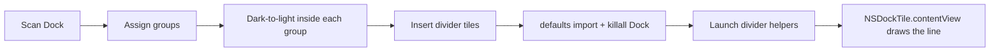

# ChromaDock

**Group the macOS Dock. Sort each group dark to light. Draw Trash-style divider lines.**

ChromaDock reads the apps currently in your Dock, lets you put them into named
groups, sorts each group by overall icon darkness (darkest on the left), and
optionally inserts vertical chrome lines between groups — the same kind of
hairline that sits to the left of Trash.

Created by [Tristan Springmeyer (`@tristan-nextcz`)](https://github.com/tristan-nextcz) and
organization-owned by [Next Citizen LLC](https://github.com/next-citizen-llc) for durable governance.

---

## What it does

1. **Scan** snapshots the live Dock: divider sections become group membership,
   then each icon is sampled.
2. **Assign** apps to groups (System, Development, Browsers, Communication,
   Media, Other — rename, reorder, or add your own).
3. **Apply** backs up the current Dock, keeps any icons you moved across
   sections since Scan, then writes groups together sorted dark → light
   (darkest on the left) with a transparent bar between groups. **Hue nudge
   preview** (optional) shows a slight neighbor-hue blend in the window;
   **Dock app icons are not recolored.**
4. **Restore** puts back the last backup taken immediately before Apply.

Finder stays on the left. Trash stays on the right. Those two are owned by
macOS and are not rearranged.



---

## Device dependencies

| Dependency | Required | Why |
| --- | --- | --- |
| **macOS 14 Sonoma or later** | Yes | SwiftUI `MenuBarExtra`, `ContentUnavailableView`, `SMAppService`. Developed on macOS 26.5.2 (Apple silicon). |
| **Apple silicon** | Yes for the shipped `.app` / `.dmg` | The release binary is `arm64`. Intel can rebuild from source. |
| Accessibility permission | No | Divider lines are drawn via `NSDockTile.contentView`, not Accessibility. |
| App Sandbox | **Must stay off** | The app writes `com.apple.dock` preferences through `/usr/bin/defaults`. |
| Apple Developer ID / notarization | No for source builds | The published DMG is **ad-hoc signed**. First launch: right-click the app → Open. |
| `sudo` / admin rights | **No** | Everything runs as your user. |

---

## Install

### Disk image

1. Download the latest `ChromaDock-*.dmg` from
   [Releases](https://github.com/next-citizen-llc/chromadock/releases/latest).
2. Open the image and drag **ChromaDock** to **Applications**.
3. Right-click → **Open** the first time (ad-hoc signature).

### Build from source

Command Line Tools are enough. Full Xcode is optional.

```bash
git clone https://github.com/next-citizen-llc/chromadock.git
cd chromadock
./scripts/build.sh
./scripts/package-dmg.sh
open build/ChromaDock.app
```

The built app is `build/ChromaDock.app`. The disk image is
`dist/ChromaDock-<version>.dmg`.

---

## Divider lines

macOS does not let a third-party app insert extra copies of the private
`DOCKSeparatorTile` used next to Trash. Empty icon artwork is filled with a
glass plate. The working approach:

- ChromaDock installs small helper apps (`llc.nextcitizen.ChromaDock.line.N`)
  into `~/Library/Application Support/ChromaDock/Lines/`.
- Each helper stays **running** and sets `NSDockTile.contentView` to a
  transparent view. **Separators** offers shipped marks: A is a solid
  hairline, B is a vertical dashed line (four dashes). Dock glass shows
  through. macOS then shows a running-app indicator under each mark.
- The hairline contrasts with the wallpaper behind that tile: a dark line on
  light regions, a light line on dark regions (including night mode). Helpers
  restyle when the desktop picture changes, and also on appearance, space,
  wake, and screen changes.
- **Keep lines drawn** relaunches those helpers after Apply, at login, and if
  a helper is quit (immediate relaunch plus a LaunchAgent so the tile stays
  a running hairline instead of falling back to an app-icon squircle).
- **Create** on the Separators picker is for future paid marks. It opens a
  dialog with subject `ChromaDock Interest` and a short editable note, then a
  link to the [nextcz.com](https://nextcz.com/) contact form. The form is the
  same GoDaddy widget as the website; only email still has to be typed.

Open at login (optional) relaunches ChromaDock so it can start those helpers
again after a reboot.

---

## Privacy

ChromaDock runs on your Mac. It reads Dock preferences and app icons, writes a
local backup of `com.apple.dock`, and launches local helper apps. The only
network use is optional: **Create** can open the nextcz.com contact form so an
interest note registers the same way as other site inquiries.

---

## License

This version is **free to use** under the MIT License in [`LICENSE`](LICENSE).
No purchase is required.

Copyright is held by Next Citizen LLC, which may offer additional or different
licenses for **future** versions, add-ons, or commercial distributions. See
[`CONTRIBUTING.md`](CONTRIBUTING.md) if you want to send a patch.

---

## Restore without the app

Backups are written to
`~/Library/Application Support/ChromaDock/Backups/`.

```bash
defaults import com.apple.dock "$HOME/Library/Application Support/ChromaDock/Backups/com.apple.dock.latest.plist"
killall Dock
```
